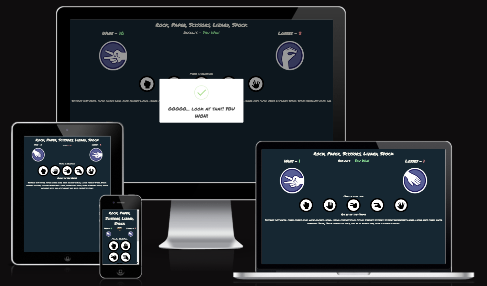
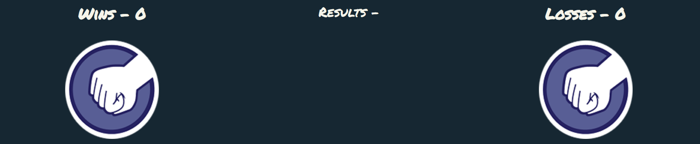
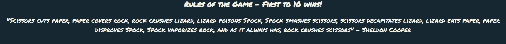
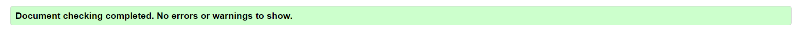
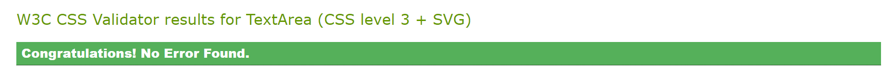

# Large Explosion Idea - Rock, Paper, Scissors, Lizard, Spock Game

'Large Explosion Idea - Rock, Paper, Scissors, Lizard, Spock' (RPSLS) is a game designed to demonstrate how Javascript can be easily utilised for a variety of requirements when building a website. The site is targeted towards fans of web based games and the popular tv series 'The Big Bang Theory' as well as fellow developers looking to understand alternative Javascript concepts. 

Large Explosion Idea - RPSLS is a fully responsive interactive game that asks users to choose one of the 5 options (Rock, Paper, Scissors, Lizard, Spock) and in turn generates a random computer choice in response, the first player to reach a score of 10 wins the match.

## Features 

This section give detailed descriptions of each part of the Large Explosion Idea game and explain the value that each feature provides to the user and how this is acheived.

### Existing Features

- __The Large Explosion Idea Heading__

  - Featured at the top of the page, the Large Explosion Idea heading is clearly readable to the user. Upon viewing the page, the user will be able to see the name of the game 'Rock, Paper, Scissors, Lizard, Spock Game'.

- __The Score Area__

  - This section is located directly below the heading and allows the user to see a more detailed image of the selection they have played, the number of wins and losses in that match and the result declaration for each round. 

- __The Game Area__

  - This section allows the user to play the RPSLS game. The user is clearly able to see the selection icons for Rock, Paper, Scissors, Lizard and Spock as represented by 'hand' silhouette icons.
  - The user is able to select the choice for that round of the game by clicking 1 of the 5 icons in the 'Make a selection:' section of the game area. 

- __The Rules section__

  - The rules section tells the user how the match winner is decided, First to 10 wins, and details how each round can be won based on the chosen icon written in a way that is easy for the user to understand. 

<!-- For some/all of your features, you may choose to reference the specific project files that implement them.

In addition, you may also use this section to discuss plans for additional features to be implemented in the future:

### Features Left to Implement

- Another feature idea -->

## Testing 

In this section, you need to convince the assessor that you have conducted enough testing to legitimately believe that the site works well. Essentially, in this part you will want to go over all of your project’s features and ensure that they all work as intended, with the project providing an easy and straightforward way for the users to achieve their goals.

In addition, you should mention in this section how your project looks and works on different browsers and screen sizes.

You should also mention in this section any interesting bugs or problems you discovered during your testing, even if you haven't addressed them yet.

If this section grows too long, you may want to split it off into a separate file and link to it from here.

### Validator Testing 

- HTML
    - No errors were returned when passing through the official [W3C validator](https://validator.w3.org/nu/#textarea)
 
- CSS 
    - No errors were found when passing through the official [(Jigsaw) validator](https://jigsaw.w3.org/css-validator/validator)
 
- JavaScript
    - No errors were found when passing through the official [Jshint validator](https://jshint.com/)
      - The following metrics were returned: 
      - There are 11 functions in this file.
      - Function with the largest signature takes 2 arguments, while the median is 0.
      - Largest function has 10 statements in it, while the median is 3.
      - The most complex function has a cyclomatic complexity value of 4 while the median is 2.

### Unfixed Bugs

You will need to mention unfixed bugs and why they were not fixed. This section should include shortcomings of the frameworks or technologies used. Although time can be a big variable to consider, paucity of time and difficulty understanding implementation is not a valid reason to leave bugs unfixed. 

## Deployment

This section should describe the process you went through to deploy the project to a hosting platform (e.g. GitHub) 

- The site was deployed to GitHub pages. The steps to deploy are as follows: 
  - In the GitHub repository, navigate to the Settings tab 
  - From the source section drop-down menu, select the Master Branch
  - Once the master branch has been selected, the page will be automatically refreshed with a detailed ribbon display to indicate the successful deployment. 

The live link can be found here - https://code-institute-org.github.io/love-maths/

## Credits 

In this section you need to reference where you got your content, media and extra help from. It is common practice to use code from other repositories and tutorials, however, it is important to be very specific about these sources to avoid plagiarism. 

You can break the credits section up into Content and Media, depending on what you have included in your project. 

### Content 

- The text for the Home page was taken from Wikipedia Article A
- Instructions on how to implement form validation on the Sign Up page was taken from [Specific YouTube Tutorial](https://www.youtube.com/)
- The icons in the footer were taken from [Font Awesome](https://fontawesome.com/)

### Media

- The photos used on the home and sign up page are from This Open Source site
- The images used for the gallery page were taken from this other open source site

Congratulations on completing your Readme, you have made another big stride in the direction of being a developer! 

## Other General Project Advice

Below you will find a couple of extra tips that may be helpful when completing your project. Remember that each of these projects will become part of your final portfolio so it’s important to allow enough time to showcase your best work! 

- One of the most basic elements of keeping a healthy commit history is with the commit message. When getting started with your project, read through [this article](https://chris.beams.io/posts/git-commit/) by Chris Beams on How to Write  a Git Commit Message 
  - Make sure to keep the messages in the imperative mood 

- When naming the files in your project directory, make sure to consider meaningful naming of files, point to specific names and sections of content.
  - For example, instead of naming an image used ‘image1.png’ consider naming it ‘landing_page_img.png’. This will ensure that there are clear file paths kept. 

- Do some extra research on good and bad coding practices, there are a handful of useful articles to read, consider reviewing the following list when getting started:
  - [Writing Your Best Code](https://learn.shayhowe.com/html-css/writing-your-best-code/)
  - [HTML & CSS Coding Best Practices](https://medium.com/@inceptiondj.info/html-css-coding-best-practice-fadb9870a00f)
  - [Google HTML/CSS Style Guide](https://google.github.io/styleguide/htmlcssguide.html#General)

Getting started with your Portfolio Projects can be daunting, planning your project can make it a lot easier to tackle, take small steps to reach the final outcome and enjoy the process! 