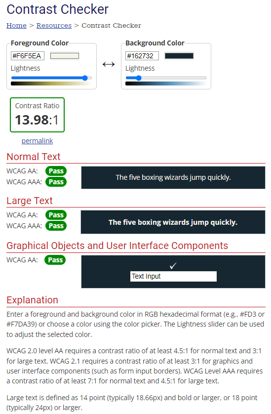

# Large Explosion Idea - Rock, Paper, Scissors, Lizard, Spock Game

'Large Explosion Idea - Rock, Paper, Scissors, Lizard, Spock' (RPSLS) is a game designed to demonstrate how Javascript can be easily utilised for a variety of requirements when building a website. The site is targeted towards fans of web based games and the popular tv series 'The Big Bang Theory' as well as fellow developers looking to understand alternative Javascript concepts. 

Large Explosion Idea - RPSLS is a fully responsive interactive game that asks users to choose one of the 5 options (Rock, Paper, Scissors, Lizard, Spock) and in turn generates a random computer choice in response, the first player to reach a score of 10 wins the match.

## Table of contents
1. [Planning Stage](#planning-stage)
1. [Features](#features)
1. [Testing](#testing)
1. [Deployment](#deployment)
1. [Technology Used](#technology-used)
1. [Credits](#credits)

## Planning Stage

### User Experience UX
- As a user, I want to access a fun, easy to use game
- As a user, I want clearly readable instructions on how the game works
- As a user, I want the game selections icons to be clearly visible
- As a user, I want to easily understand who the winner of each round and match is

### Site Owner’s Aims
- As the owner, I want to present a simple to use, fun web-based game
- As the owner, I want to educate the user on how to play Rock, Paper, Scissors, Lizard, Spock
- As the owner, I want to provide a simple score tracking function which declares a match winner when a player reaches 10 round wins
- As the owner, I want to introduce the user to Javascript programming concepts

### Colour Scheme
I chose a dark colour scheme for the game website design to give a sense of calming to the user to help promote a positive user experience. I opted for a dark Blue (#162732) for the site background and a plain off-white (#F6F5EA) for the text colour to prevent any colour contrast ratio issues. I used(https://webaim.org/resources/contrastchecker/) to check the contrasting colours worked well.
 - Main background

 

## Features 

This section give detailed descriptions of each part of the Large Explosion Idea game and explain the value that each feature provides to the user and how this is acheived.

### Existing Features

- __The Large Explosion Idea Heading__

  - Featured at the top of the page, the Large Explosion Idea heading is clearly readable to the user. Upon viewing the page, the user will be able to see the name of the game 'Rock, Paper, Scissors, Lizard, Spock Game'.

- __The Score Area__

  - This section is located directly below the heading and allows the user to see a more detailed image of the selection they have played, the number of wins and losses in that match and the result declaration for each round. 

- __The Game Area__

  - This section allows the user to play the RPSLS game. The user is clearly able to see the selection icons for Rock, Paper, Scissors, Lizard and Spock as represented by 'hand' silhouette icons.
  - The user is able to select the choice for that round of the game by clicking 1 of the 5 icons in the 'Make a selection:' section of the game area. 

- __The Rules section__

  - The rules section tells the user how the match winner is decided, First to 10 wins, and details how each round can be won based on the chosen icon written in a way that is easy for the user to understand. 

<!-- For some/all of your features, you may choose to reference the specific project files that implement them.

In addition, you may also use this section to discuss plans for additional features to be implemented in the future:

### Features Left to Implement

- Another feature idea -->

## Testing 

I have tested the site in the Chrome, Firefox and Edge browsers, using dev tools to test responsiveness. I have also asked users to review on various mobiles devices; both Android and IOS had no issues fed back.

### **Responsiveness**

The Chrome browser built in Dev tool was used for responsive testing as well as using various mobile/tablet devices. I also used (http://ami.responsivedesign.is/) to check there were no issues across all screen sizes. No issues were found.

**Below 800px (Tablets/Mobiles)**
- This is the tablet/mobile version with images stacked on top of each other

- Game selection images and results text reduce in size to keep the layout side by side
- Heading font size reduces as to stop the heading becoming over bearing on the page
- Selection icons stack down into a 2-2-1 layout
- Rules text content is fully responsive with the page size

### **Lighthouse**
All pages have been tested with lighthouse for both mobile and desktop devices with all scores acheiving above 90, however my performance score for mobile was 4 points lower than desktop. Testing through lighthouse was extremely useful for highlighting areas where best practice can be followed

- Although Large Explosion Idea - RPSLS scored well on lighthouse tests, the best practices score on desktop was 92 due to the game images not being high resolution. 

- Tested Lighthouse on mobile

- Tested Lighthouse on desktop

### Validator Testing 

- HTML
    - No errors were returned when passing through the official [W3C validator](https://validator.w3.org/nu/#textarea)
 
- CSS 
    - No errors were found when passing through the official [(Jigsaw) validator](https://jigsaw.w3.org/css-validator/validator)
 
- JavaScript
    - No errors were found when passing through the official [Jshint validator](https://jshint.com/)
      - The following metrics were returned: 
      - There are 7 functions in this file.
      - Function with the largest signature takes 2 arguments, while the median is 0.
      - Largest function has 17 statements in it, while the median is 2.
      - The most complex function has a cyclomatic complexity value of 5 while the median is 1.
    - Although there were no errors when running through the JSHint validator, there were 23 warnings consisting of:
      - 'const' is available in ES6 (use 'esversion: 6') or Mozilla JS extensions (use moz).
      - 'let' is available in ES6 (use 'esversion: 6') or Mozilla JS extensions (use moz).
      - 'for of' is available in ES6 (use 'esversion: 6') or Mozilla JS extensions (use moz).
      - Functions declared within loops referencing an outer scoped variable may lead to confusing semantics. (playGame)
      - 'arrow function syntax (=>)' is only available in ES6 (use 'esversion: 6').
    - The Jshint checker also picked up on 1 undefined variable 'Swal', however, this coding is intentional as this was sourced from an external site (referenced below).

### Bugs/Fixes and Unfixed Bugs

counter not increasing until next icon clicked - fix, moved playerScore to about innerHTML
images not loading on selection - fix, src needed to be options[compChoice]
icon styling not working on iphone (ongoing)

## Deployment

- The site was deployed to GitHub pages. The steps to deploy are as follows: 
  - In the GitHub repository 'Portfolio2', navigate to the Settings tab above the green Gitpod button
  - On the left hand side of the page navigate down to the 'pages' tab
  - Under the 'Branch' subheading, select 'main' from the branch drop down menu and press save
  - Once the main branch has been selected, the page will be automatically refreshed with a detailed ribbon display to indicate the successful deployment. 

The live link can be found here - [Large Explosion Idea - Rock, Paper, Scissors, Lizard, Spock Game](https://andyl86.github.io/Portfolio2/)

## Technology Used
Large Explosion Idea - RPSLS was built using HTML5, CSS3 and Javascript

## Credits

### Content
- Font was sourced from Google Fonts (https://fonts.google.com/)
- Color schemes were sourced through Colorspace (https://mycolor.space/)
- Some similarities to the Code Institues Love Maths project may occur throughout the code, although I have implented my own variations to this code 
- W3C was used for various problem solving and coding research (https://w3.org)
- Icons used are from Font Awesome (https://fontawesome.com/)
- Coding for the match winner pop up window was sourced from Sweetalert (https://sweetalert2.github.io/)

### Media
- The game selection images were sourced from (https://steamcommunity.com)

### Thanks
 - Richard Wells (https://github.com/D0nni387) - Code Institute mentor, without his patience and support I would not have been able to complete my project to a standard that I am happy with
 